# System Design Architecture Diagrams

## 0. Simplified Infrastructure Flow (Client → API Gateway → Load Balancer → Services)

### Text-Based Flow Diagram

```
┌─────────────────────────────────────────────────────────────────┐
│                    CLIENT LAYER                                 │
│  ┌──────────┐  ┌──────────┐  ┌──────────┐                     │
│  │ Browser  │  │  Mobile  │  │   Web    │                     │
│  │  Client  │  │   App    │  │   App    │                     │
│  └────┬─────┘  └────┬─────┘  └────┬─────┘                     │
└───────┼─────────────┼─────────────┼────────────────────────────┘
        │             │             │
        └─────────────┴─────────────┘
                      │
                      │ HTTPS Request
                      ▼
┌─────────────────────────────────────────────────────────────────┐
│                  API GATEWAY LAYER                              │
│  ┌──────────────────────────────────────────────────────────┐  │
│  │  API Gateway (Azure API Management / AWS API Gateway)     │  │
│  │  • Authentication & Authorization                       │  │
│  │  • Rate Limiting & Throttling                            │  │
│  │  • Request Routing & Versioning                          │  │
│  │  • Request/Response Transformation                       │  │
│  └──────────────────────────────────────────────────────────┘  │
└────────────────────────────┬───────────────────────────────────┘
                              │
                              │ Authenticated Request
                              ▼
┌─────────────────────────────────────────────────────────────────┐
│                LOAD BALANCER LAYER                              │
│  ┌──────────────────────────────────────────────────────────┐  │
│  │  Application Load Balancer                                │  │
│  │  • Health Checks                                          │  │
│  │  • SSL/TLS Termination                                    │  │
│  │  • Session Affinity (Sticky Sessions)                    │  │
│  │  • Traffic Distribution (Round Robin / Least Connections) │  │
│  └──────────────────────────────────────────────────────────┘  │
└────────────────────────────┬───────────────────────────────────┘
                              │
        ┌─────────────────────┼─────────────────────┐
        │                     │                     │
        ▼                     ▼                     ▼
┌──────────────┐    ┌──────────────┐    ┌──────────────┐
│ Next.js App  │    │ Next.js App  │    │ Next.js App  │
│   Server 1   │    │   Server 2   │    │   Server N   │
│  (Port 3000) │    │  (Port 3000) │    │  (Port 3000) │
└──────┬───────┘    └──────┬───────┘    └──────┬───────┘
       │                  │                   │
       └──────────────────┼───────────────────┘
                          │
                          │ API Calls
                          ▼
┌─────────────────────────────────────────────────────────────────┐
│                  EXTERNAL SERVICES LAYER                       │
│  ┌──────────────┐  ┌──────────────┐  ┌──────────────┐       │
│  │   Backend    │  │   Backend    │  │   Data API   │       │
│  │  Service 1   │  │  Service 2   │  │   Service    │       │
│  └──────────────┘  └──────────────┘  └──────────────┘       │
│  ┌──────────────┐  ┌──────────────┐  ┌──────────────┐       │
│  │   User       │  │   Config     │  │   Report     │       │
│  │   Service    │  │   Service    │  │   Service    │       │
│  └──────────────┘  └──────────────┘  └──────────────┘       │
└─────────────────────────────────────────────────────────────────┘
```

### Request Flow Sequence

```
1. Client sends HTTPS request
   ↓
2. API Gateway receives request
   ├─ Validates authentication token
   ├─ Applies rate limiting rules
   ├─ Routes to appropriate backend
   └─ Transforms request if needed
   ↓
3. Load Balancer receives request
   ├─ Performs health check on servers
   ├─ Terminates SSL/TLS connection
   ├─ Determines target server (load balancing algorithm)
   └─ Routes to selected Next.js server
   ↓
4. Next.js Application Server processes request
   ├─ Handles API route (/api/service, /api/data, etc.)
   ├─ Makes business logic decisions
   └─ Calls external backend services
   ↓
5. External Services respond
   ├─ Backend services return data
   └─ Response flows back through layers
   ↓
6. Response returns to client
   └─ Through: Next.js → Load Balancer → API Gateway → Client
```

### Mermaid Diagram

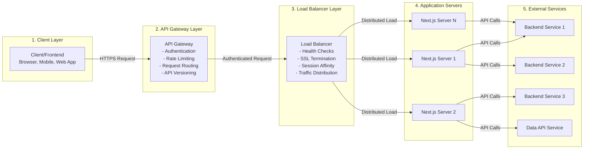

## 1. Overall System Architecture

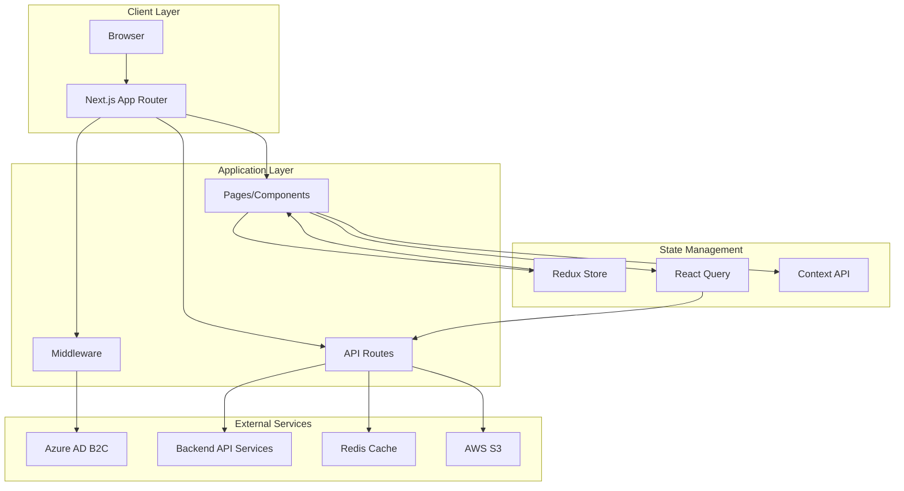

## 2. Request Flow Architecture

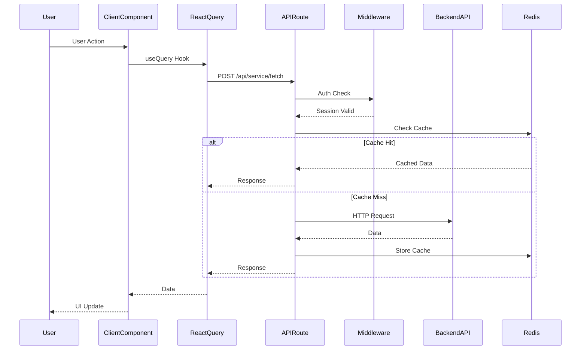

## 3. Component Hierarchy

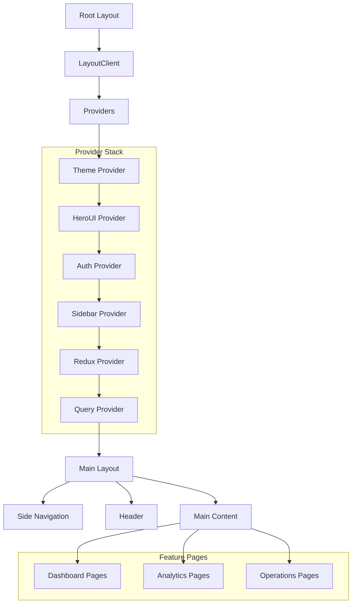

## 4. State Management Architecture

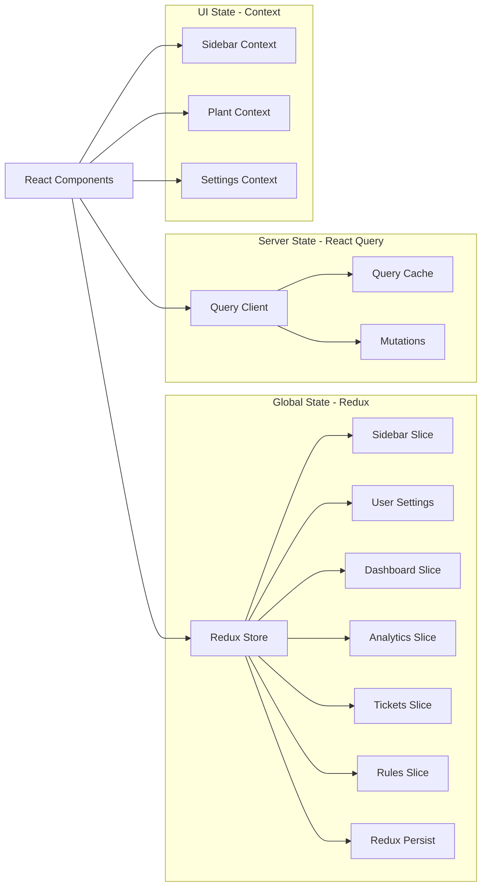

## 5. Authentication Flow

# Azure AD B2C Login Flow — Explained in Easy Language

Think of the login process like this:

- **Azure B2C** = the place where the user logs in  
- **Your Backend Database** = the place where you store user details + settings  
- **NextAuth** = the messenger between Azure and your app  
- **JWT Cookie** = the user’s access pass  

Now let’s walk through it step by step.

### ✅ 1. User starts login
- User goes to `/login`
- They click **“Login with Azure AD B2C”**
- The app redirects them to Azure’s login page

### ✅ 2. Azure AD B2C shows login form
- Azure displays the Microsoft-branded login page
- User enters **email + password**
- Azure verifies the credentials
- If correct → Azure sends back an **authorization code**  
  (This code means: “Yes, this user is real and logged in successfully.”)

### ✅ 3. NextAuth exchanges the code for tokens
- NextAuth takes the authorization code and asks Azure:  
  “Give me the user’s profile and tokens.”
- Azure responds with:
  - Access Token
  - ID Token
  - User Profile (email, name, etc.)

### ✅ 4. Find the user in your database
- NextAuth extracts the email from Azure and checks your backend:
  - Sends request → `GET /user/email/{email}`
- Your backend runs:
  ```sql
  SELECT * FROM users WHERE email = ?
  - If user exists → return user info
  - If not → new user can be created (optional)

### ✅ 5. Get the User’s Settings
- The database returns user settings such as : user role, plant list available environment etc

### Update the User’s Environment (If Needed)
- NextAuth updates environment settings: POST /user/{userId}/settings
- Backend returns the updated settings.

### ✅ 7. Create the JWT Token
- NextAuth builds a JWT token containing: userId, user roles, user settings, QUADRICAL_ENV

### ✅ 8. Store Token in Cookie & Create Session
- JWT stored in an HTTP-only cookie
- Session now has all user data
- No need to query database again on every page load

### ✅ 9. Redirect the User to the App
- User is redirected to /
- Now the user: is logged in, has session cookie, can open protected pages

  ### ✅ 10. User Accesses Protected Pages
- When user opens any protected route:Middleware checks the session cookie, If valid → allow access, If invalid → send user to /login
- 
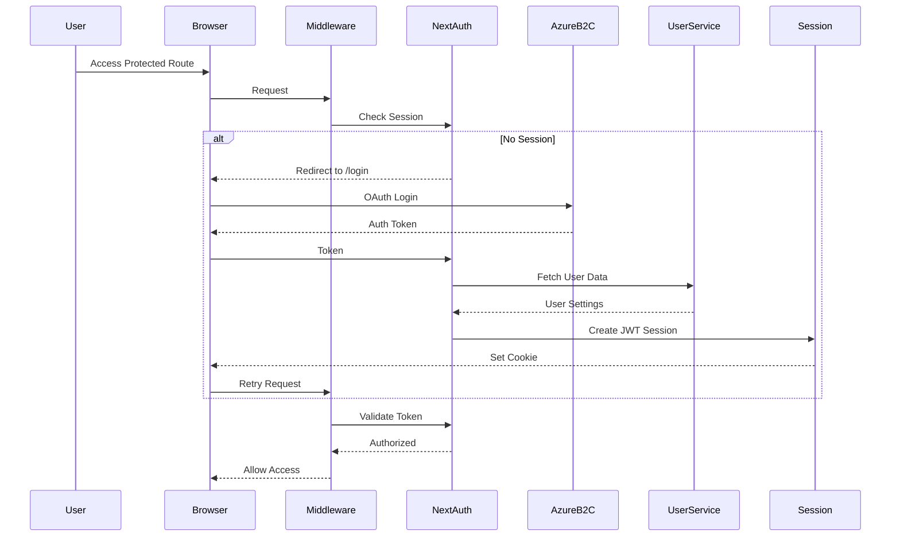

## 6. API Route Architecture

```mermaid
graph TD
    subgraph "Client Side"
        ClientComponent[Client Component]
        Serialize[Serialize Payload]
    end
    
    subgraph "Next.js API Routes"
        ServiceRoute[/api/service]
        FetchRoute[/api/service/fetch]
        FetchAllRoute[/api/service/fetchall]
        DataRoute[/api/data/*]
        UserRoute[/api/user/*]
        ReportsRoute[/api/reports/*]
    end
    
    subgraph "API Route Processing"
        AuthCheck[Auth Check]
        Deserialize[Deserialize]
        CacheCheck[Cache Check]
        RequestBuilder[Request Builder]
    end
    
    subgraph "External Services"
        BackendAPI[Backend API]
        RedisCache[Redis Cache]
        S3Storage[S3 Storage]
    end
    
    ClientComponent --> Serialize
    Serialize --> ServiceRoute
    ServiceRoute --> AuthCheck
    AuthCheck --> Deserialize
    Deserialize --> CacheCheck
    CacheCheck --> RedisCache
    CacheCheck --> RequestBuilder
    RequestBuilder --> BackendAPI
    FetchRoute --> AuthCheck
    FetchAllRoute --> AuthCheck
    DataRoute --> BackendAPI
    UserRoute --> BackendAPI
    ReportsRoute --> BackendAPI
```

## 7. Data Flow Diagram

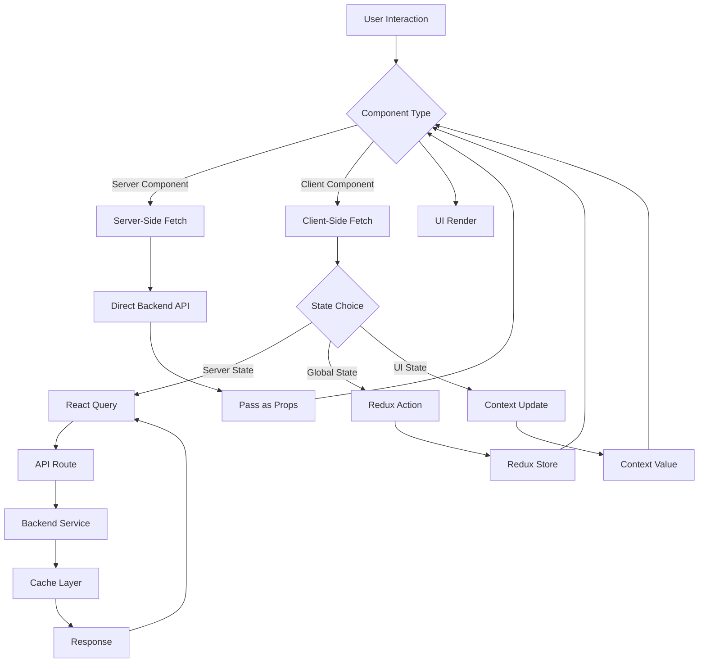

## 8. Feature Module Structure

```mermaid
graph TD
    subgraph "app/ main/"
        MainLayout[Main Layout]
        
        subgraph "Analytics Module"
            AnalyticsPage[analytics/page.tsx]
            TrendsClient[TrendsClient.tsx]
            AnalyticsAPI[analytics/api.ts]
        end
        
        subgraph "Dashboard Module"
            DashboardPage[dashboard/page.tsx]
            DashboardClient[DashboardClient.tsx]
            DashboardAPI[dashboard/api.ts]
        end
        
        subgraph "Operations Module"
            OperationsPage[operations/page.tsx]
            OperationsClient[OperationsClient.tsx]
        end
        
        subgraph "Shared Components"
            SideNav[SideNav.tsx]
            Header[Header.tsx]
            Charts[Chart Components]
        end
    end
    
    subgraph "API Routes"
        ServiceAPI[/api/service]
        DataAPI[/api/data]
        ReportsAPI[/api/reports]
    end
    
    subgraph "Redux Slices"
        AnalyticsSlice[analyticsSlice]
        DashboardSlice[dashboardSlice]
        OperationsSlice[operationsSlice]
    end
    
    MainLayout --> AnalyticsPage
    MainLayout --> DashboardPage
    MainLayout --> OperationsPage
    
    AnalyticsPage --> TrendsClient
    DashboardPage --> DashboardClient
    OperationsPage --> OperationsClient
    
    TrendsClient --> AnalyticsAPI
    DashboardClient --> DashboardAPI
    
    AnalyticsAPI --> ServiceAPI
    DashboardAPI --> ServiceAPI
    
    TrendsClient --> AnalyticsSlice
    DashboardClient --> DashboardSlice
```

## 9. Caching Strategy

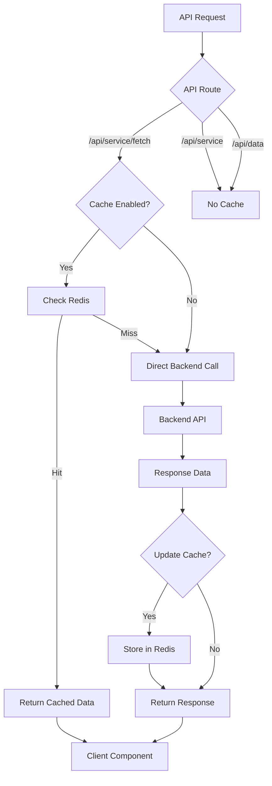

## 10. Build and Deployment Flow

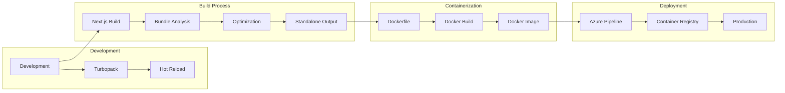

## 11. Security Architecture

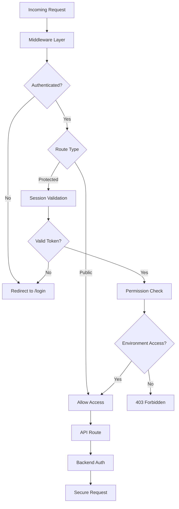

## 12. Performance Optimization Layers

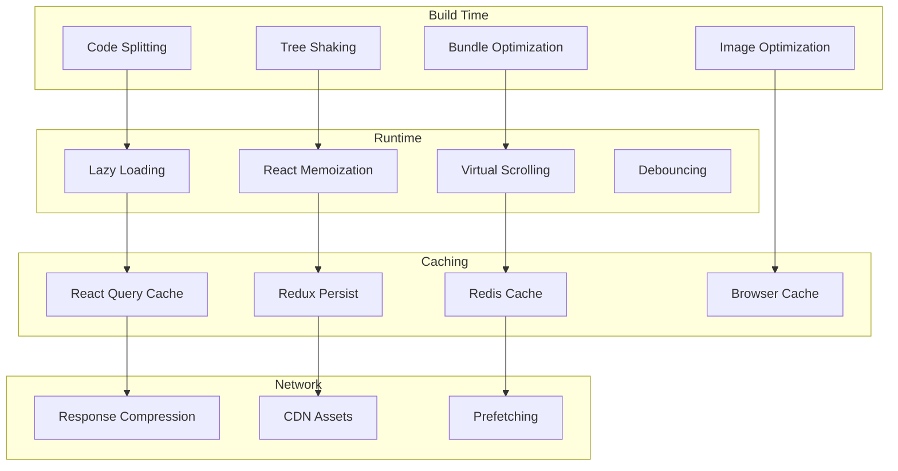

## 17. Azure AD B2C Login Flow: User Authentication & Database Integration

### Complete Login Flow Sequence

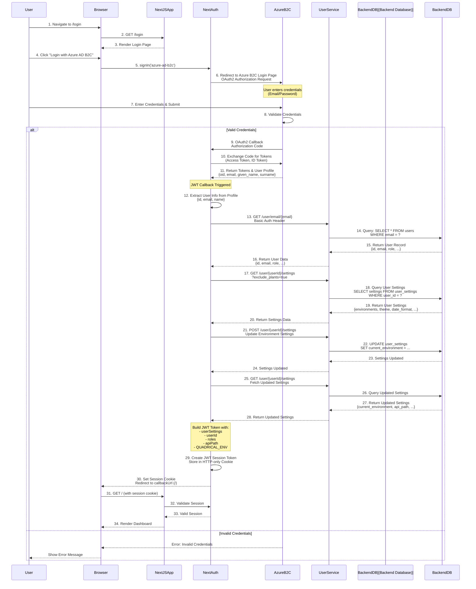

### Login Flow Architecture Diagram

```mermaid
graph TB
    subgraph "1. User Initiation"
        User[User]
        LoginPage[Login Page<br/>/login]
    end
    
    subgraph "2. Authentication Layer"
        NextAuth[NextAuth.js<br/>Authentication Handler]
        AzureB2C[Azure AD B2C<br/>Identity Provider]
    end
    
    subgraph "3. Token Processing"
        JWT[JWT Callback<br/>Token Builder]
        Session[Session Callback<br/>Session Builder]
    end
    
    subgraph "4. User Service Integration"
        UserServiceAPI[User Service API<br/>Backend Service]
        UserEndpoint[/user/email/{email}]
        SettingsEndpoint[/user/{id}/settings]
    end
    
    subgraph "5. Database Layer"
        BackendDB[(Backend Database)]
        UsersTable[(users table)]
        SettingsTable[(user_settings table)]
    end
    
    subgraph "6. Session Storage"
        Cookie[HTTP-only Cookie<br/>JWT Token]
        SessionStore[Session Store]
    end
    
    User -->|1. Click Login| LoginPage
    LoginPage -->|2. signIn| NextAuth
    NextAuth -->|3. OAuth Redirect| AzureB2C
    AzureB2C -->|4. User Credentials| AzureB2C
    AzureB2C -->|5. Auth Code| NextAuth
    NextAuth -->|6. Exchange Code| AzureB2C
    AzureB2C -->|7. Tokens & Profile| NextAuth
    NextAuth -->|8. Trigger| JWT
    JWT -->|9. Fetch User| UserServiceAPI
    UserServiceAPI -->|10. Query| UserEndpoint
    UserEndpoint -->|11. SQL Query| UsersTable
    UsersTable -->|12. User Data| UserEndpoint
    UserEndpoint -->|13. Return| UserServiceAPI
    UserServiceAPI -->|14. User Info| JWT
    JWT -->|15. Fetch Settings| SettingsEndpoint
    SettingsEndpoint -->|16. SQL Query| SettingsTable
    SettingsTable -->|17. Settings Data| SettingsEndpoint
    SettingsEndpoint -->|18. Return| JWT
    JWT -->|19. Update Settings| SettingsEndpoint
    SettingsEndpoint -->|20. UPDATE Query| SettingsTable
    JWT -->|21. Build Token| Session
    Session -->|22. Store| Cookie
    Cookie -->|23. Set Cookie| User
```

### Database Schema & Data Flow

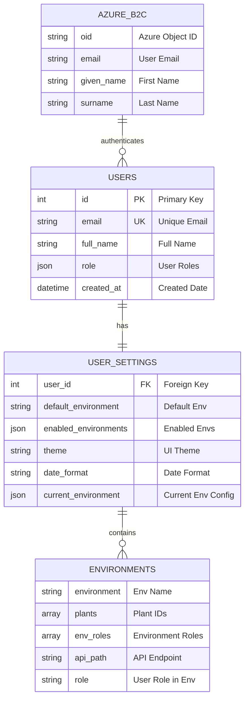

### Step-by-Step Login Process

```mermaid
flowchart TD
    Start[User Visits /login] --> ClickLogin[User Clicks Login Button]
    ClickLogin --> RedirectAzure[Redirect to Azure AD B2C]
    RedirectAzure --> AzureLogin[Azure B2C Login Page]
    AzureLogin --> EnterCreds[User Enters Credentials]
    EnterCreds --> ValidateAzure{Azure Validates}
    
    ValidateAzure -->|Invalid| Error[Show Error]
    Error --> AzureLogin
    
    ValidateAzure -->|Valid| AuthCode[Azure Returns Auth Code]
    AuthCode --> ExchangeToken[NextAuth Exchanges Code for Token]
    ExchangeToken --> GetProfile[Get User Profile from Azure]
    GetProfile --> ExtractInfo[Extract: email, oid, name]
    
    ExtractInfo --> CheckDB{User Exists<br/>in Database?}
    
    CheckDB -->|No| CreateUser[Create User in DB<br/>POST /user]
    CreateUser --> FetchUser[Fetch User from DB]
    
    CheckDB -->|Yes| FetchUser[Fetch User from DB<br/>GET /user/email/{email}]
    
    FetchUser --> FetchSettings[Fetch User Settings<br/>GET /user/{id}/settings]
    FetchSettings --> UpdateSettings[Update Environment Settings<br/>POST /user/{id}/settings]
    UpdateSettings --> GetUpdatedSettings[Get Updated Settings]
    
    GetUpdatedSettings --> BuildToken[Build JWT Token with:<br/>- userSettings<br/>- userId<br/>- roles<br/>- apiPath<br/>- QUADRICAL_ENV]
    
    BuildToken --> CreateSession[Create Session]
    CreateSession --> SetCookie[Set HTTP-only Cookie]
    SetCookie --> RedirectApp[Redirect to Application]
    RedirectApp --> Dashboard[User Sees Dashboard]
```

### Data Synchronization Flow

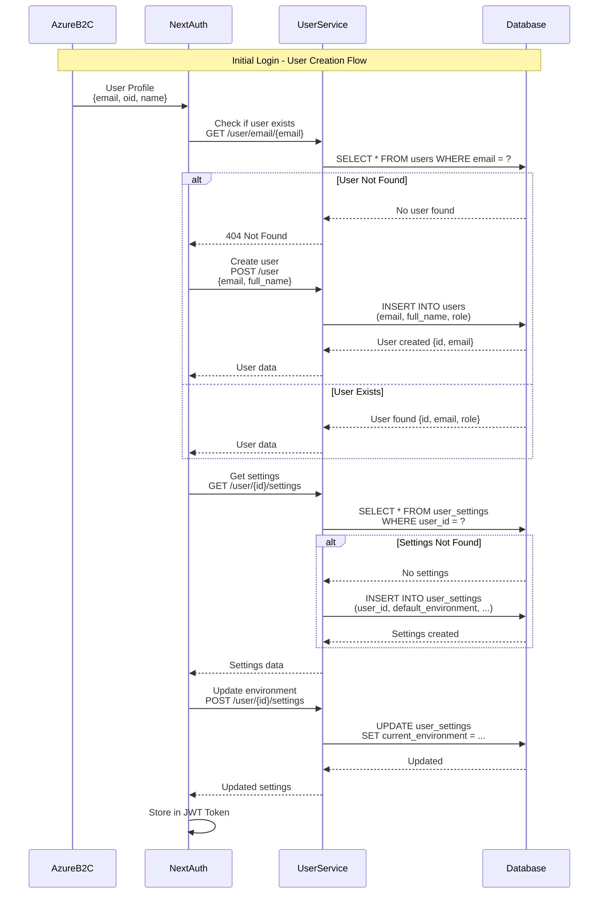

### Authentication State Management

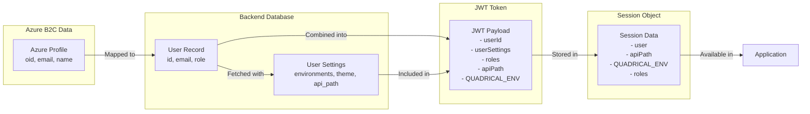

## 13. Infrastructure Flow: Client → API Gateway → Load Balancer → Services

```mermaid
graph TB
    subgraph "Client Layer"
        Browser[Browser/Client]
        Mobile[Mobile App]
        WebApp[Web Application]
    end
    
    subgraph "CDN & Edge"
        CDN[CDN/CloudFront]
        EdgeCache[Edge Cache]
    end
    
    subgraph "API Gateway Layer"
        APIGateway[API Gateway<br/>Azure API Management / AWS API Gateway]
        RateLimit[Rate Limiting]
        AuthGateway[Auth Gateway]
        RequestRouting[Request Routing]
    end
    
    subgraph "Load Balancer Layer"
        LoadBalancer[Load Balancer<br/>Application Load Balancer]
        HealthCheck[Health Checks]
        SSLTerm[SSL Termination]
        SessionSticky[Session Affinity]
    end
    
    subgraph "Application Servers"
        AppServer1[Next.js Server 1]
        AppServer2[Next.js Server 2]
        AppServer3[Next.js Server N]
    end
    
    subgraph "API Routes Layer"
        NextAPIRoutes[Next.js API Routes]
        ServiceRoute[/api/service]
        DataRoute[/api/data]
        UserRoute[/api/user]
    end
    
    subgraph "External Services Layer"
        BackendAPI1[Backend API Service 1]
        BackendAPI2[Backend API Service 2]
        DataAPI[Data API Service]
        UserService[User Service]
        ConfigService[Config Service]
    end
    
    subgraph "Data & Cache Layer"
        RedisCluster[Redis Cluster]
        Database[(Database)]
        S3Storage[S3 Storage]
    end
    
    subgraph "Authentication Services"
        AzureB2C[Azure AD B2C]
        AuthService[Auth Service]
    end
    
    Browser --> CDN
    Mobile --> APIGateway
    WebApp --> CDN
    CDN --> EdgeCache
    EdgeCache --> APIGateway
    
    APIGateway --> RateLimit
    RateLimit --> AuthGateway
    AuthGateway --> AzureB2C
    AuthGateway --> RequestRouting
    
    RequestRouting --> LoadBalancer
    
    LoadBalancer --> HealthCheck
    LoadBalancer --> SSLTerm
    LoadBalancer --> SessionSticky
    
    HealthCheck --> AppServer1
    HealthCheck --> AppServer2
    HealthCheck --> AppServer3
    
    SSLTerm --> AppServer1
    SSLTerm --> AppServer2
    SSLTerm --> AppServer3
    
    SessionSticky --> AppServer1
    SessionSticky --> AppServer2
    SessionSticky --> AppServer3
    
    AppServer1 --> NextAPIRoutes
    AppServer2 --> NextAPIRoutes
    AppServer3 --> NextAPIRoutes
    
    NextAPIRoutes --> ServiceRoute
    NextAPIRoutes --> DataRoute
    NextAPIRoutes --> UserRoute
    
    ServiceRoute --> LoadBalancer
    DataRoute --> LoadBalancer
    UserRoute --> LoadBalancer
    
    LoadBalancer --> BackendAPI1
    LoadBalancer --> BackendAPI2
    LoadBalancer --> DataAPI
    LoadBalancer --> UserService
    LoadBalancer --> ConfigService
    
    BackendAPI1 --> RedisCluster
    BackendAPI2 --> RedisCluster
    DataAPI --> Database
    UserService --> Database
    ConfigService --> Database
    
    BackendAPI1 --> S3Storage
    DataAPI --> S3Storage
    UserService --> AuthService
```

## 14. Detailed Request Flow: Infrastructure Level

```mermaid
sequenceDiagram
    participant Client
    participant CDN
    participant APIGateway
    participant LoadBalancer
    participant NextJSApp
    participant APIRoute
    participant BackendService
    participant Redis
    participant Database
    
    Client->>CDN: 1. HTTP Request
    CDN->>CDN: 2. Check Edge Cache
    alt Cache Hit
        CDN-->>Client: 3a. Return Cached Response
    else Cache Miss
        CDN->>APIGateway: 3b. Forward Request
        APIGateway->>APIGateway: 4. Rate Limiting Check
        APIGateway->>APIGateway: 5. Authentication/Authorization
        APIGateway->>LoadBalancer: 6. Route Request
        LoadBalancer->>LoadBalancer: 7. Health Check & SSL Termination
        LoadBalancer->>LoadBalancer: 8. Session Affinity Routing
        LoadBalancer->>NextJSApp: 9. Forward to App Server
        NextJSApp->>APIRoute: 10. Process API Route
        APIRoute->>Redis: 11. Check Cache
        alt Cache Hit
            Redis-->>APIRoute: 11a. Return Cached Data
        else Cache Miss
            APIRoute->>LoadBalancer: 11b. Request Backend Service
            LoadBalancer->>BackendService: 12. Route to Backend
            BackendService->>Database: 13. Query Database
            Database-->>BackendService: 14. Return Data
            BackendService-->>APIRoute: 15. Return Response
            APIRoute->>Redis: 16. Cache Response
        end
        APIRoute-->>NextJSApp: 17. Return Data
        NextJSApp-->>LoadBalancer: 18. Return Response
        LoadBalancer-->>APIGateway: 19. Return Response
        APIGateway->>CDN: 20. Cache Response
        APIGateway-->>Client: 21. Return Response
    end
```

## 15. Network Architecture with Load Balancing

```mermaid
graph LR
    subgraph "Internet"
        Users[Users]
    end
    
    subgraph "Edge Layer"
        CDN[CDN]
        WAF[Web Application Firewall]
    end
    
    subgraph "API Gateway Tier"
        Gateway1[API Gateway Instance 1]
        Gateway2[API Gateway Instance 2]
        GatewayLB[Gateway Load Balancer]
    end
    
    subgraph "Application Tier"
        LB[Application Load Balancer]
        TargetGroup[Target Group]
    end
    
    subgraph "Next.js Application Servers"
        App1[Next.js Server 1<br/>Port 3000]
        App2[Next.js Server 2<br/>Port 3000]
        App3[Next.js Server 3<br/>Port 3000]
    end
    
    subgraph "Backend Services Tier"
        BackendLB[Backend Load Balancer]
        Service1[Backend Service 1]
        Service2[Backend Service 2]
        Service3[Backend Service 3]
    end
    
    subgraph "Data Tier"
        RedisMaster[Redis Master]
        RedisReplica1[Redis Replica 1]
        RedisReplica2[Redis Replica 2]
        DBPrimary[(Primary DB)]
        DBReplica[(Replica DB)]
    end
    
    Users --> CDN
    CDN --> WAF
    WAF --> GatewayLB
    GatewayLB --> Gateway1
    GatewayLB --> Gateway2
    Gateway1 --> LB
    Gateway2 --> LB
    LB --> TargetGroup
    TargetGroup --> App1
    TargetGroup --> App2
    TargetGroup --> App3
    App1 --> BackendLB
    App2 --> BackendLB
    App3 --> BackendLB
    BackendLB --> Service1
    BackendLB --> Service2
    BackendLB --> Service3
    Service1 --> RedisMaster
    Service2 --> RedisMaster
    Service3 --> RedisMaster
    RedisMaster --> RedisReplica1
    RedisMaster --> RedisReplica2
    Service1 --> DBPrimary
    Service2 --> DBPrimary
    Service3 --> DBPrimary
    DBPrimary --> DBReplica
```

## 16. Complete Infrastructure Stack

```mermaid
graph TB
    subgraph "Layer 1: Client Devices"
        WebClient[Web Browser]
        MobileClient[Mobile App]
        DesktopClient[Desktop App]
    end
    
    subgraph "Layer 2: Content Delivery"
        CloudFront[CloudFront/CDN]
        EdgeLocations[Edge Locations]
    end
    
    subgraph "Layer 3: Security & Gateway"
        WAF[WAF - DDoS Protection]
        APIGateway[API Gateway<br/>- Request Routing<br/>- Rate Limiting<br/>- Authentication]
    end
    
    subgraph "Layer 4: Load Balancing"
        ALB[Application Load Balancer<br/>- Health Checks<br/>- SSL Termination<br/>- Path-based Routing]
    end
    
    subgraph "Layer 5: Application Servers"
        AutoScaling[Auto Scaling Group]
        EC2Instance1[EC2/Container Instance 1<br/>Next.js App]
        EC2Instance2[EC2/Container Instance 2<br/>Next.js App]
        EC2Instance3[EC2/Container Instance N<br/>Next.js App]
    end
    
    subgraph "Layer 6: API Routes"
        NextAPIRoutes[Next.js API Routes<br/>/api/service<br/>/api/data<br/>/api/user]
    end
    
    subgraph "Layer 7: Service Mesh"
        ServiceMesh[Service Mesh<br/>- Service Discovery<br/>- Circuit Breaker<br/>- Retry Logic]
    end
    
    subgraph "Layer 8: Backend Services"
        Microservice1[Microservice 1]
        Microservice2[Microservice 2]
        Microservice3[Microservice 3]
        DataService[Data Service]
        UserService[User Service]
    end
    
    subgraph "Layer 9: Data Layer"
        ElastiCache[ElastiCache/Redis<br/>- Cache Cluster]
        RDS[(RDS Database<br/>- Primary & Replicas)]
        S3[S3 Storage<br/>- Object Storage]
    end
    
    subgraph "Layer 10: External Services"
        AzureB2C[Azure AD B2C]
        Monitoring[Monitoring Services]
        Logging[Logging Services]
    end
    
    WebClient --> CloudFront
    MobileClient --> APIGateway
    DesktopClient --> APIGateway
    CloudFront --> EdgeLocations
    EdgeLocations --> WAF
    WAF --> APIGateway
    APIGateway --> ALB
    ALB --> AutoScaling
    AutoScaling --> EC2Instance1
    AutoScaling --> EC2Instance2
    AutoScaling --> EC2Instance3
    EC2Instance1 --> NextAPIRoutes
    EC2Instance2 --> NextAPIRoutes
    EC2Instance3 --> NextAPIRoutes
    NextAPIRoutes --> ServiceMesh
    ServiceMesh --> Microservice1
    ServiceMesh --> Microservice2
    ServiceMesh --> Microservice3
    ServiceMesh --> DataService
    ServiceMesh --> UserService
    Microservice1 --> ElastiCache
    Microservice2 --> ElastiCache
    DataService --> RDS
    UserService --> RDS
    Microservice1 --> S3
    DataService --> S3
    APIGateway --> AzureB2C
    EC2Instance1 --> Monitoring
    EC2Instance2 --> Logging
```

